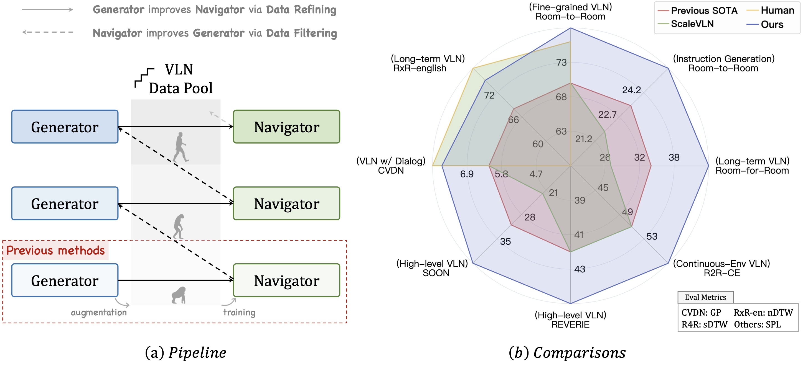

# Bootstrapping Language-Guided Navigation Learning with Self-Refining Data Flywheel

[](https://arxiv.org/abs/2412.08467)   

#### [Zun Wang](https://zunwang1.github.io/), [Jialu Li](https://jialuli-luka.github.io/), [Yicong Hong](http://www.yiconghong.me/), [Songze Li](https://scholar.google.com/citations?user=8rBMUD4AAAAJ), [Kunchang Li](https://andy1621.github.io/), [Shoubin Yu](https://yui010206.github.io/), [Yi Wang](https://shepnerd.github.io/), [Yu Qiao](https://scholar.google.com/citations?hl=en&user=gFtI-8QAAAAJ), [Yali Wang](https://scholar.google.com/citations?user=hD948dkAAAAJ),  [Mohit Bansal](https://www.cs.unc.edu/~mbansal/), [Limin Wang](https://wanglimin.github.io/)

<br>

<br>

## Data Release and Reproducibility Note
Please note that the original full dataset used in our final experiments is no longer recoverable due to an unexpectedly early and complete deletion of the first author's institutional account and personal storage. This deletion occurred after the author's departure (which was prior to paper submission) but before the paper was accepted, and appears to have been accidental during internal system maintenance.

As a result, we are only able to release an intermediate version of the dataset saved during the development phase. Although this version may yield slightly lower performance for training the best model (**~85% SR and ~78% SPL** on R2R val unseen) compared to the results reported in the paper, it still significantly outperforms strong baselines such as ScaleVLN (81% SR and 70% SPL). **We also released our final pretrained model.**

**Available Data:**
1. `mantis.hm3d_round0_topk.3_enc.json` – Generated instructions via sampling on HM3D in the first round.  
2. `mantis.hm3d_round3_greedy_ndtw0.9_ranked_414k_rouge0.85.json` – A subset of generated instructions via greedy decoding from the final-round generator (25.7 SPICE).

Unfortunately, the generated instructions on MP3D and the final refined dataset are no longer available.

We sincerely appreciate your understanding and are happy to address any questions regarding reproducibility.

## Installation

Please follow [ScaleVLN](https://github.com/wz0919/ScaleVLN) to set up the environment and training source code.

## Model and Data

We release our final pretrained model and available data [here](https://huggingface.co/datasets/ZunWang/SRDF/tree/main). Details:

**Model:**
1. `model_step_170000.pt` – The final pretrained model for downstream finetuning.

**Data:**
1. `mantis.hm3d_round0_topk.3_enc.json` – Generated instructions via sampling on HM3D in the first round.  
2. `mantis.hm3d_round3_greedy_ndtw0.9_ranked_414k_rouge0.85.json` – A subset of generated instructions via greedy decoding from the final-round generator (25.7 SPICE).


**Features:**
1. `internvit_6b_fov60_mp3d.hdf5` – InternViT features on MP3D environments.  
2. `internvit_6b_fov60_mp3d_panogen.hdf5` – InternViT features on Panogen-augmented MP3D environments.  
3. `scans_internvit_6b/` – Contains InternViT features for all HM3D + MP3D environments.

## Training

Our training process follows [ScaleVLN](https://github.com/wz0919/ScaleVLN) with minimal modifications.

**Pretraining:**  
Update the [pretraining config file](https://github.com/wz0919/ScaleVLN/blob/main/VLN-DUET/pretrain_src/config/r2r_pretrain_hm3d%2Bmp3d%2Bgibson_clip-h14.json) to use:
- InternViT features from `features/scans_internvit_6b/`
- Our sampling-generated instructions: `data/mantis.hm3d_round0_topk.3_enc.json` 
Empirically, training for 1–2 epochs is sufficient.
(Note: You may need to transfer `data/mantis.hm3d_round0_topk.3_enc.json` to a `jsonl` file where each item is aligned with ScaleVLN’s pretraining input format. (like `R2R/annotations/pretrain_map/R2R_hm3d_aug_envdrop_generated_enc.jsonl`) in ScaleVLN)

**Finetuning:**  
To finetune on downstream tasks, modify:
- The [augmented environment path](https://github.com/wz0919/ScaleVLN/blob/1189fe898462e2e10908631070bcf2d4ec2204b2/VLN-DUET/map_nav_src/r2r/parser.py#L133) to `features/internvit_6b_fov60_mp3d_panogen.hdf5`
- `args.features` to take in `features/internvit_6b_fov60_mp3d.hdf5`
- The [training script](https://github.com/wz0919/ScaleVLN/blob/1189fe898462e2e10908631070bcf2d4ec2204b2/VLN-DUET/map_nav_src/scripts/r2r_h14_envedit_mix.sh) to:
  - Set feature dim to 3072
  - Use our pretrained checkpoint: `model/model_step_170000.pt` or your own pretrained checkpoint
  - Use our augmented data (Only for R2R finetuning): `data/mantis.hm3d_round3_greedy_ndtw0.9_ranked_414k_rouge0.85.json`

# Citation

If you find our project useful in your research, please cite the following paper:

```bibtex
@article{zun2024srdf,
    author = { Wang, Zun and  Li, Jialu and Hong, Yicong and Li, Songze and Li, Kunchang and Yu, Shoubin and Wang, Yi and Qiao, Yu and Wang, Yali and Bansal, Mohit and Wang, Limin},
    title  = {Bootstrapping Language-Guided Navigation Learning with Self-Refining Data Flywheel},
	journal   = {arxiv},
	year      = {2024},
	url       = {https://arxiv.org/abs/2412.08467}
}
```
